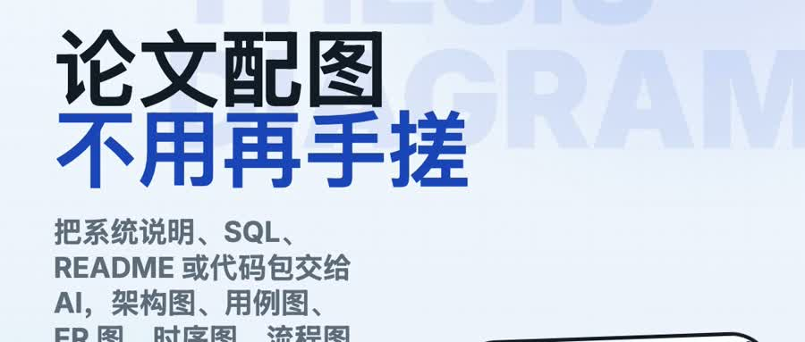
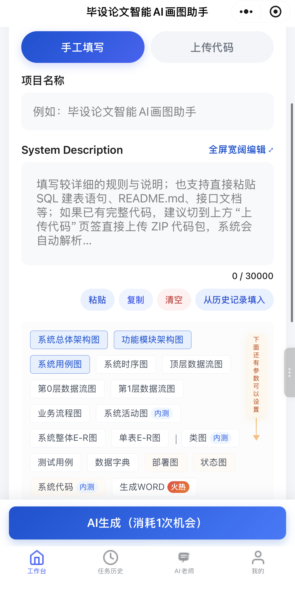
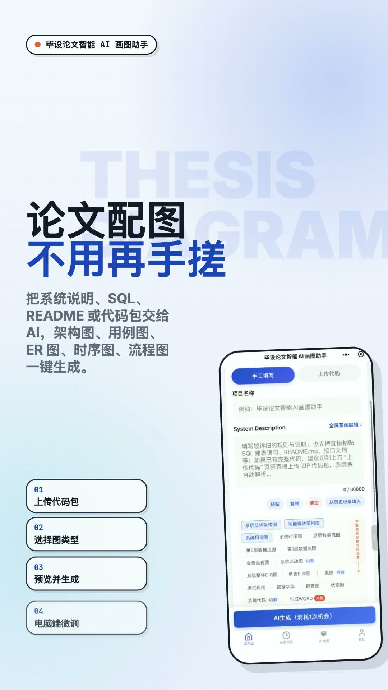
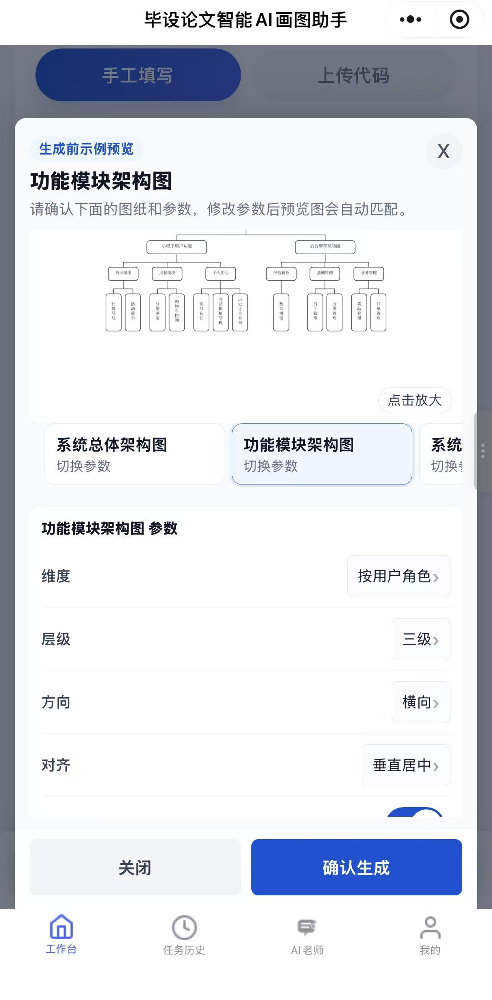
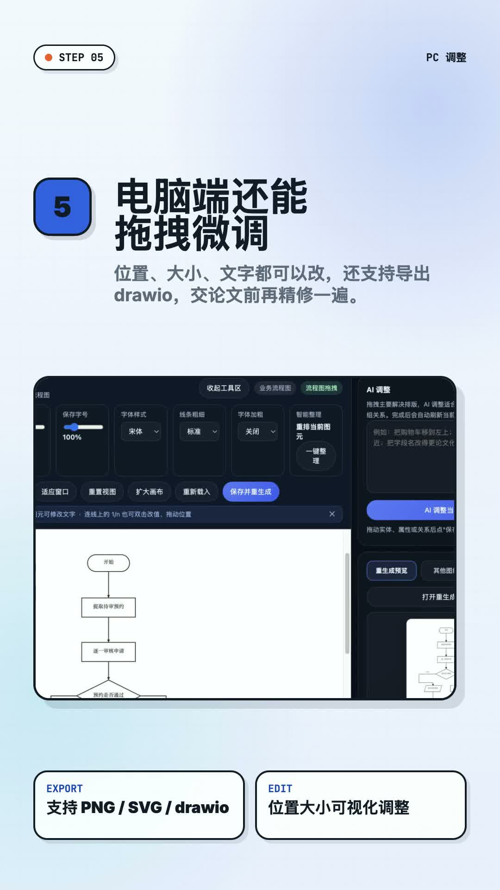
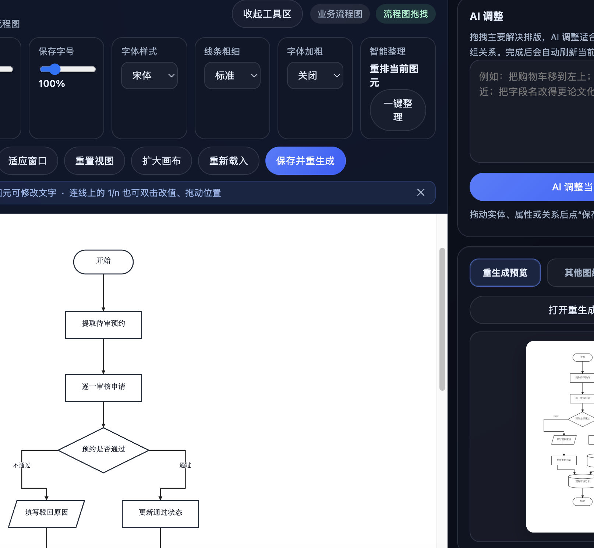
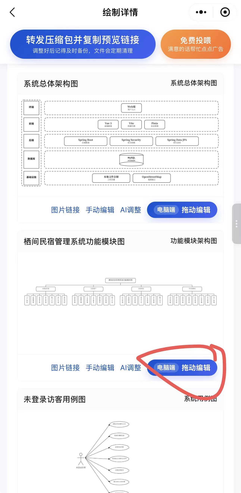
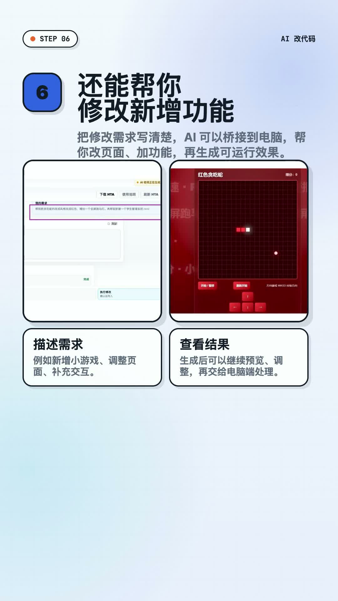
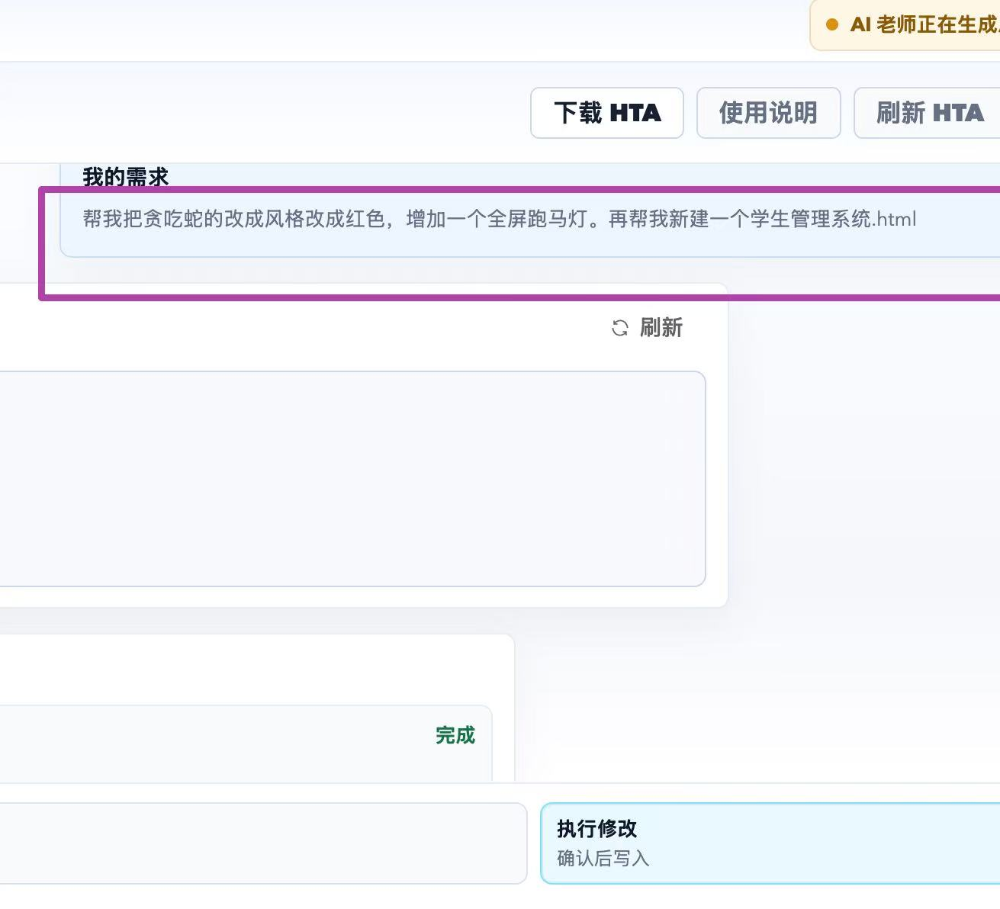
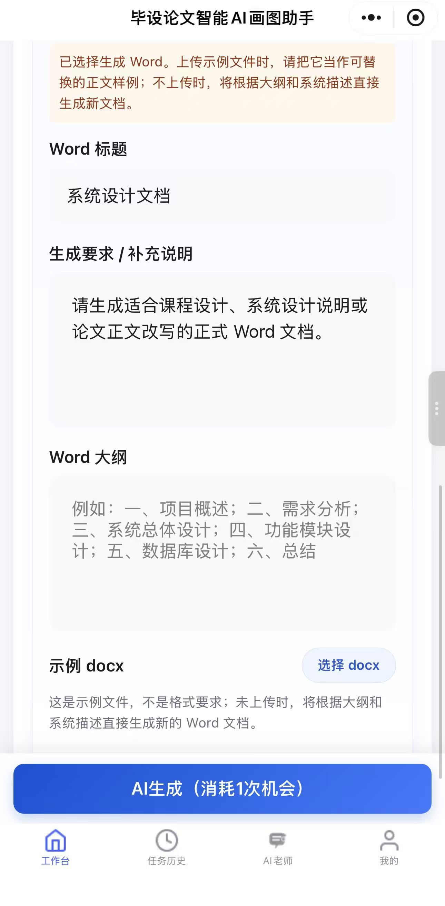

# 毕设论文智能 AI 画图助手

> 上传系统说明、SQL、README、接口文档或代码压缩包，让 AI 自动生成毕业设计论文需要的系统架构图、功能模块图、ER 图、流程图、类图、时序图、用例图、数据流图、三线表和论文说明内容。  
> 适合计算机毕业设计、课程设计、答辩 PPT 配图、论文系统设计章节、数据库设计章节、测试章节和代码讲解场景。

## 一、工具简介

毕设论文智能 AI 画图助手是一款面向计算机专业毕业设计的在线 AI 辅助工具，核心目标是解决学生在论文和答辩阶段最头疼的几个问题：不会画系统架构图、ER 图、用例图、流程图；图纸画得不规范；线条交叉、排版混乱；数据库设计说明不会写；代码看不懂；论文配图和三线表需要反复手工整理。

它不是普通的“AI 生图工具”，而是围绕软件工程毕业设计交付标准设计的一站式工具。用户可以通过文字描述、SQL 建表语句、README 文档、接口文档或项目代码包，让系统自动解析项目业务、角色权限、数据库表结构、接口逻辑和模块关系，再生成适合放进论文和答辩 PPT 的专业图表与说明内容。

工具同时支持小程序端和 PC 电脑端。小程序适合快速提交需求、查看历史记录、预览生成结果；PC 端适合上传代码、精细调整图纸、AI 重排版、修改文字、导出 PNG、SVG、drawio 等格式，最终用于论文定稿和答辩展示。

## 二、适合哪些人使用

- 正在写计算机毕业设计论文，需要补齐系统设计图、数据库设计图、流程图和测试表格的同学。
- 已经有 Java、Spring Boot、SSM、Vue、小程序、Web 管理系统等项目代码，但不会整理论文配图的同学。
- 只有选题、需求说明或功能描述，还没写完整代码，需要先生成论文初稿和系统设计材料的同学。
- 需要把 SQL 数据表转换成 ER 图、数据字典、三线表的同学。
- 需要给答辩 PPT 准备系统架构图、功能模块图、用例图、业务流程图的同学。
- 看不懂项目代码、不会修改功能、不会解释系统逻辑，需要 AI 老师辅助讲解和改代码的同学。

## 三、可以生成哪些论文素材

本工具覆盖毕业设计论文中常见的图纸、表格和说明内容，适用于需求分析、系统设计、数据库设计、详细设计、系统测试、答辩展示等章节。

### 1. 架构设计类图纸

支持生成系统总体架构图、系统部署图等，用来展示前端、后端、数据库、第三方服务、文件存储、AI 服务等模块之间的关系。适合放在论文的系统总体设计章节，也适合放进答辩 PPT 说明系统整体结构。

### 2. 功能设计类图纸

支持生成功能模块图、系统用例图、业务流程图、活动图、状态图等。AI 会根据项目描述自动拆解用户角色、功能层级、业务流程和模块关系，帮助解决“功能模块不知道怎么分”“用例图角色不会画”“流程图节点不完整”的问题。

### 3. 数据库设计类图纸和表格

支持根据 SQL、数据库表结构、项目代码或文字描述生成整体 ER 图、单表 ER 图、类图、数据字典三线表等内容。可以自动识别实体、字段、主键、外键、表关系和字段含义，适合论文数据库设计章节直接使用。

### 4. 交互逻辑类图纸

支持生成系统时序图、类图、接口调用流程图等内容，用来展示前端、后端、数据库、第三方服务之间的请求响应顺序。对于 Java 项目、前后端分离项目、小程序项目和后台管理系统，时序图可以帮助论文更清楚地表达核心业务逻辑。

### 5. 测试与论文文档素材

支持生成测试用例三线表、数据字典三线表、图表说明、模块说明、数据库设计说明、系统流程说明等内容。也可以结合已有 Word 论文范文或初稿，辅助替换和补充符合当前项目的论文内容。

## 四、四种输入方式，适配不同毕设阶段

不管你的项目现在是刚有想法、已经写了一部分，还是完整代码已经做完，都可以选择合适的输入方式生成论文材料。

### 1. 手动文字描述

如果你还没有完整代码，可以直接输入项目名称、用户角色、功能模块、业务流程、数据库大概字段等文字描述。AI 会根据描述自动整理系统结构，生成 ER 图、功能模块图、用例图、流程图、活动图等内容。

适合场景：

- 项目还在初稿阶段。
- 只有开题报告、需求说明或功能列表。
- 需要先把论文系统设计章节搭起来。

### 2. 文档粘贴输入

可以直接粘贴 SQL 建表语句、README 项目说明、接口文档、需求说明书、数据库字段说明等资料。系统会自动提取数据表、接口、角色、模块和业务逻辑，再生成对应的论文图纸和表格。

适合场景：

- 已经有 SQL 文件，需要生成 ER 图和数据字典。
- 已经有 README 或需求说明，需要生成系统设计图。
- 已经有接口文档，需要生成时序图和流程图。

### 3. 代码包上传

如果你的项目已经写完，可以上传 ZIP 压缩包。系统会自动过滤无关文件，解析核心业务代码、实体类、控制器、接口、数据库相关代码和页面功能，再生成更贴合项目真实逻辑的图纸与说明。

中小型项目解析通常需要等待一段时间，解析完成后可以反复复用，不需要每次重新上传。

### 4. 历史记录复用

所有上传、解析和生成记录都会保存。后续需要生成不同类型图纸时，可以直接从历史项目中继续生成，无需重复粘贴资料或重新上传代码，大幅减少返工时间。

## 五、六步完成论文配图

### 第一步：进入工具，选择使用端

支持手机小程序端和 PC 电脑端。手机端适合快速提交需求、查看任务、预览图纸；PC 端适合上传代码、调参数、精修图纸和导出定稿文件。论文最终定稿建议使用 PC 端操作，排版和导出效果更稳定。

官网入口：<https://bishe.jf3q.com/>

### 第二步：选择输入模式，录入项目资料

根据自己当前进度选择“手工填写”或“上传代码”。没有代码时填写项目名称、系统描述、角色权限和功能模块；已有代码或文档时上传 ZIP、SQL、README、接口文档等资料，等待系统解析。

### 第三步：勾选需要生成的图纸和表格

可以根据论文目录自由选择需要生成的内容，例如功能模块图、系统用例图、ER 图、流程图、类图、时序图、数据字典、测试用例表等。支持单选、多选和组合生成。

### 第四步：生成前预览，提前调整参数

生成前可以先预览图纸结构和样式，根据项目复杂度调整模块层级、布局方向、展示模式、对齐方式等参数。预览阶段提前优化，可以减少生成后反复修改的时间。

### 第五步：一键 AI 生成成品素材

确认资料和参数无误后，点击生成按钮。系统会自动分析项目内容，生成对应图纸、表格和说明文本。生成完成后可以在任务历史中查看、下载和继续编辑。

### 第六步：PC 端精细编辑，导出论文定稿

自动生成后的图纸可以继续在 PC 端精修：拖拽调整节点位置、缩放画布、修改文字、调整字号、切换布局、优化线条、处理重叠元素，也可以使用 AI 一键优化排版。最终支持导出 PNG、SVG、drawio 等格式，方便插入 Word 论文和答辩 PPT。

## 六、核心功能详解

### 1. AI 论文图纸生成

围绕计算机毕业设计常见交付内容，支持生成 15+ 种论文常用图纸和表格，包括但不限于系统架构图、部署图、功能模块图、用例图、流程图、活动图、状态图、ER 图、类图、时序图、数据流图、数据字典三线表、测试用例三线表等。

生成内容不是单纯画图，而是会结合项目业务逻辑、数据库结构和角色权限进行组织，让图纸更适合论文系统设计、数据库设计和答辩说明。

### 2. 生成前预览和参数调节

在正式生成之前，可以先查看预览效果，并根据需要调整布局方向、模块层级、节点展示方式和图纸风格。对于模块多、流程复杂的项目，可以优先使用上下布局或分组展示，减少线条交叉和节点拥挤。

### 3. PC 端精修和多格式导出

PC 端支持细节调整，是论文定稿的重要环节。用户可以手动拖拽节点、调整连线、修改文字、缩放画布、统一字号和间距，也可以使用 AI 自动优化布局。导出格式支持 PNG、SVG、drawio，既能用于 Word 论文，也能用于 PPT 和后续二次编辑。

### 4. AI 老师：讲代码、讲图纸、写说明

AI 老师可以辅助理解项目和论文内容。用户可以上传代码、图纸截图、需求说明或论文片段，让 AI 解释代码逻辑、梳理业务流程、生成图表说明、检查论文描述是否和图纸一致，也可以让 AI 帮忙整理答辩时的讲解话术。

### 5. AI 代码修改和功能新增

对于不会改代码、项目有报错、页面样式不好看、功能不完整的情况，可以使用 AI 代码修改能力。通过专属工具连接本地项目后，可以提交修改需求，让 AI 辅助定位代码、修复问题、新增功能、调整页面样式和优化业务逻辑。

### 6. AI Word 论文初稿辅助

支持上传已有论文初稿或范文，让 AI 根据当前系统的功能、图表和数据库结构，辅助替换项目名称、功能描述、系统设计章节、数据库设计说明、测试说明和图表解释，帮助用户更快整理出符合自己项目的论文材料。

## 七、手机端和电脑端功能差异

### 手机小程序端

手机端适合快速使用核心功能：提交项目描述、上传基础资料、选择图纸类型、查看生成结果、复用历史记录、进行基础预览和轻量编辑。对于临时补图、快速查看效果、保存任务记录非常方便。

### PC 电脑端

PC 端适合最终定稿：上传完整代码包、深度调节参数、精细编辑图纸、AI 重排版、导出高清图片和 drawio 文件、使用代码修改能力。论文正式提交前，建议统一在 PC 端检查图纸字号、间距、线条、布局和导出清晰度。

## 八、推荐参数和图纸规范

### 1. 功能模块图

建议默认使用三级层级。如果模块数量较少，可以使用纵向结构；如果模块较多，建议切换为上下布局或分组布局，避免节点堆叠和线条交叉。功能名称应尽量简洁，保持论文风格统一。

### 2. 系统用例图

建议保留系统边界、用户角色和核心用例，减少过多花哨元素。角色包括管理员、普通用户、学生、教师、商家等，应根据项目实际功能命名。用例名称建议使用“管理用户”“发布公告”“提交订单”“查看统计”等动宾结构。

### 3. ER 图和数据字典

数据库设计章节建议同时准备整体 ER 图、关键表 ER 图和数据字典三线表。字段较多时可以拆分单表展示，避免整张 ER 图过于拥挤。数据字典建议保留字段名、类型、长度、是否主键、是否为空、字段说明等关键列。

### 4. 时序图

时序图建议选择核心业务生成，例如登录注册、下单支付、提交申请、管理员审核、文件上传、AI 生成任务等。图中保留主要参与者和关键调用链即可，不必展示所有细枝末节。

### 5. 数据流图

数据流图建议先用清晰的文字描述系统外部实体、处理过程、数据存储和数据流向，再生成 0 层图和 1 层图。生成后需要检查数据流名称是否准确，处理节点是否覆盖核心业务。

### 6. 测试用例和三线表

测试用例表建议覆盖登录、注册、核心业务新增、查询、修改、删除、异常输入、权限校验等场景。生成后可以根据论文要求调整表头字段，保持三线表格式简洁统一。

## 九、新手避坑指南

- 资料越具体，生成结果越准确。建议提供项目名称、用户角色、功能模块、核心流程、数据库表和技术栈。
- 不要只输入一句很短的描述。比如“学生管理系统”太笼统，最好补充管理员、学生、课程、成绩、公告、选课等具体功能。
- 代码包上传前建议删除无关文件，例如 node_modules、target、dist、日志文件、临时文件和大体积缓存文件。
- 图纸生成后不要直接定稿，建议在 PC 端统一调整字号、间距、布局和线条，让论文整体更规范。
- ER 图字段太多时，建议拆分为整体关系图和关键表详情图，避免一张图塞得过满。
- 复杂业务流程建议拆成多个图，例如用户端流程、管理员端流程、支付流程、审核流程分别展示。
- 答辩前可以用 AI 老师检查图文是否一致，避免论文写的是 A 功能，图里却展示 B 流程。

## 十、常见问题 FAQ

### 1. 没有完整代码可以使用吗？

可以。没有代码时，可以直接输入系统描述、功能列表、SQL 建表语句、README、开题报告或需求说明。资料越完整，生成的图纸越贴近真实项目。

### 2. 已经有代码，能自动分析吗？

可以。上传 ZIP 项目代码包后，系统会解析核心代码、接口、实体类、数据库结构和页面功能，再生成适合论文使用的图纸与说明。

### 3. 生成的图纸可以修改吗？

可以。支持生成前预览调参，生成后也可以在 PC 端拖拽、修改文字、调整布局、AI 优化排版，并导出为 PNG、SVG、drawio 等格式。

### 4. 和普通 AI 绘图工具有什么区别？

普通 AI 绘图更偏视觉图片，本工具更偏毕业设计论文交付。它关注的是系统架构、业务逻辑、数据库关系、UML 图、数据字典、测试用例和论文说明，生成内容更适合放入计算机毕业设计论文。

### 5. 支持哪些项目类型？

支持常见计算机毕业设计项目，包括 Java、Spring Boot、SSM、Vue、HTML、微信小程序、后台管理系统、商城系统、预约系统、论坛系统、校园管理系统、图书管理系统、医院管理系统等。

### 6. 可以用于答辩 PPT 吗？

可以。系统架构图、功能模块图、用例图、核心流程图、ER 图和时序图都适合放进答辩 PPT。建议导出高清 PNG 或 SVG，保证投影时清晰。

## 十一、推荐搜索关键词

- 毕设论文 AI 画图工具
- 毕业设计 ER 图生成
- 在线画 ER 图
- 在线画流程图
- AI 生成功能模块图
- AI 生成系统用例图
- AI 生成时序图
- SQL 生成 ER 图
- 代码生成论文图
- 计算机毕设论文配图
- 毕设数据字典三线表
- 毕设测试用例三线表
- AI 讲解代码
- AI 修改代码
- Spring Boot 毕设论文工具
- Vue 毕设论文配图
- 小程序毕设论文配图

## 十二、立即使用

电脑端官网：<https://bishe.jf3q.com/>

建议流程：先准备项目描述、SQL、README 或代码压缩包，再进入工具选择需要生成的图纸类型。生成后使用 PC 端完成最后的排版微调和导出，这样更适合直接放进论文和答辩 PPT。

